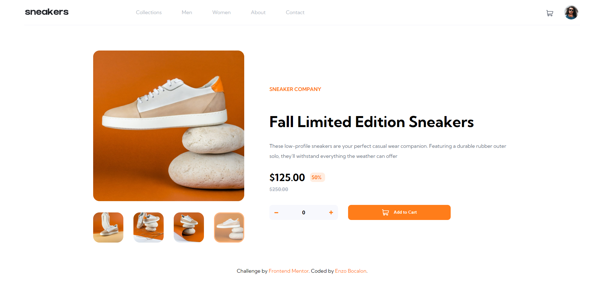

# E-commerce product page

## The challenge

Users should be able to:

- View the optimal layout for the site depending on their device's screen size
- See hover states for all interactive elements on the page
- Open a lightbox gallery by clicking on the large product image
- Switch the large product image by clicking on the small thumbnail images
- Add items to the cart
- View the cart and remove items from it

## Screenshot of the final solution

## Links

You can find my solution online at 

- Github pages [https://enzobocalon.github.io/frontend-ecommerce/]

## Tools

- React and CSS3

## Author

- Enzo Bocalon [https://github.com/enzobocalon]
